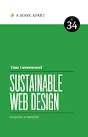

I just finished [Sustainable Web Design][] by Tom Greenwood. I was super excited when I picked this up. I assumed (I judged by the cover) that this was going to be about how, as a developer/designer I can do my job sustainably. Maybe some tricks about burnout, or meeting deadlines, or work/life balance.

Boy, was I wrong! This book is actually a TOTALLY different topic! This book talks about the environmental impacts that our websites take on our planet, which I have never even considered. (I guess I should have guessed that byu the author’s last name!) There is a significant amount of energy to create websites, host them, run them 24/7/365, transmit them over the internet, and view them on users devices! And, a lot of this energy can be traced back to carbon emissions.

1. Did you know that if the internet was its own country, it would be the the 7th most polluting company in the world? That boggles my mind!

2. In 2020, the median page-weight is 1.96 Mb (ours is more like 12-26 Mb, or over 10x that amount, for the record). There is a way you can calculate how may grams of CO2 your page is using [Website Carbon Calculator][], but our website takes too long to run and times out (ha!).

3. Reducing your page-weight is one of the best ways to be eco-friendly. The page will spend less time and energy on servers, transferring, and rendering on the users device. This can be done with smaller, fewer, or optimized images, simpler code, or less third-party trackers. Moving resources closer to the user is also a huge win (CDN and caching). Not only does this help the environment, but it’s been proven to help with SEO, customer satisfaction, and even sales.

4. Data centers use a ton of electricity to power the computers and keep them cool. It’s expected that by 2030 data centers will consume up to 3-13% of global electricity, compared to 1% in 2010. They are obviously incentivized to be efficient, but as data center consumers we need to be conscientious of our global impact.

Anyway, not what I thought, but still a pretty good book. I definitely learned a lot and hope to be a little more efficient in the things I work on.

[Sustainable Web Design]: https://abookapart.com/products/sustainable-web-design "Sustainable Web Design"
[Website Carbon Calculator]: https://www.websitecarbon.com/ "Website Carbon Calculator"

