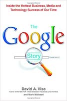

I just finished [The Google Story][] by David A. Vise. It’s the biography of Google. It’s fun to hear about a couple of guys with a dream, a felt need, inventing something from scratch, and it paying off.

I really appreciate that they were even able to recognize that they couldn’t or shouldn’t even run their own company -- they realized that they wanted to innovate and play. So, they hired a CEO and a company around them so they could be themselves.

I love how Google was able to see the long game of revenue and play that out with their vision. I love how they were able to stick to their core values of “don’t be evil” and “having a healthy disregard for the impossible” (at least in their own minds). I especially love how Google treats everything as an experiment and things stick that work, and they shed what doesn’t.

It was a fun book. I remember hearing about Google in maybe 1998. I, like others, was using Alta Vista, Ask Jeeves, and Yahoo!. But, I admired Google’s algorithm and their simplicity, and like others early on, switched. Its a fun story of innovation, dreaming big dreams, and putting everything you have into something you love.

[The Google Story]: https://www.amazon.com/Google-Story-2018-Updated-Technology-ebook/dp/B000FCKIXW/ref=tmm_kin_swatch_0?_encoding=UTF8&qid=1631021692&sr=8-3 "The Google Story"
