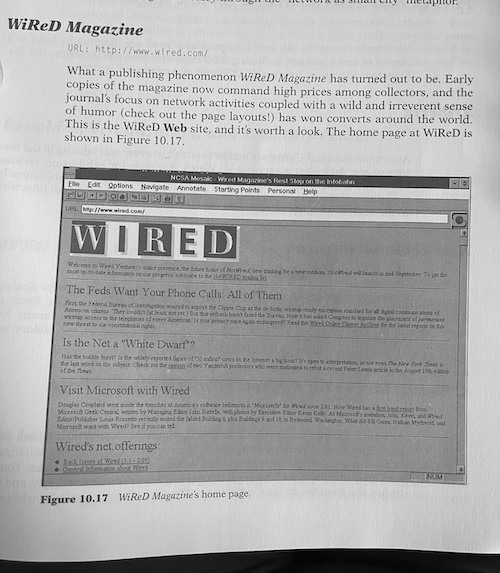

I just finished _The Mosaic Navigator: The Essential Guide to the Internet Interface_. This was fun. It’s a manual from 1995 for Mosaic, the very first browser (pre-Chrome/Firefox/Safari/IE/Netscape!). Not only could it handle HTTP (websites), but it could also do User Groups, FTP, and TelNet, which was a huge deal back then. Fun fact (not in this book), Mozilla, the company behind Firefox, named their company to be the Mosaic (the market leader) killer, tying together “Mosaic” and “Godzilla”.

Obviously there wasn’t much to pull from for today, but it was cool to see where the internet was in 1995 and contrast that with today.

There were some interesting things in here:

1. Installing Mosaic was hard. You couldn’t just go to their website and download it, because you didn’t have a browser. You had to either open up your terminal and use the command line to get it, or you could order the disks (the software was free, but you had to pay for the disk itself and shipping). Downloading it would take hours, and then you would have to unzip it (something built into Windows and MacOS today, but that was a tedious process back then, which this book lays out!)

2. All Mosaic could do is render text. If you wanted images, crappy video, or music you had to install “viewers” to render them.

3. Back then, there wasn’t any styling on webpages. Mosaic had a grey background (optionally, you could make it white, which was not recommended), and you could choose the font. There were no colors. HTML was reaaaaallly basic back then!

4. Of course, there were no tabs, built-in email, Javascript, PNGs, Flash support. Settings for the app were a text file you had to edit. Modems were generally a 14.4 baud modem (literally, 14.4 _characters per second could be downloaded_). Images are recommended to be used sparingly.

5. The hot ideas in this app were forward and back buttons (oooh), a home button (aaah), an address bar (wow), and a QuickList/HotList menus (precursors to Bookmarks). It sounds silly, but before this you had to write down or memorize URLs to everything. This was groundbreaking, so much so that all of these thing are considered essential to today’s browsers and are remarkably similar to these basic versions.

6. The book touts that at the time of writing there were almost 3900 websites in the world! In fact, the last chapter is a list of the author’s favorite websites that he has discovered!

7. The author gets excited about InfoSeek, a subscription-based, searchable index of the internet (think, paid-Google). Would have been a different world if that was still a thing! Whew!

I don’t recommend anyone else here waste their time with it, but I sure thought this book was fun.

Here is WiReD from 1995!

