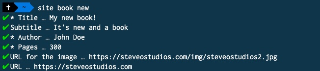
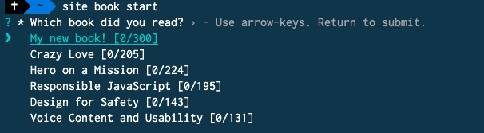
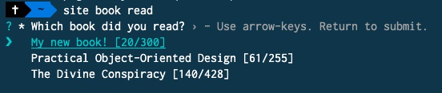
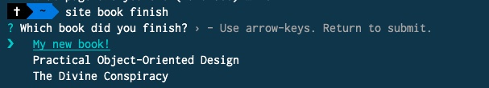

I just finished a CLI for my website. Was it necessary? Probably not. Is it going to be overwhelmingly useful? Not sure yet. Was it fun to build? Absolutely!

I've read a few blog posts over the last few years about building CLIs and, which I thought it was cool, never thought I would want or need one. I can almost always find something that someone already created to solve my needs. Or my needs are one-off, which don't require a tool. However, I was sitting down, updating my [books page](/books), which I do several times a week and thought, "huh... this could be easier with a CLI!"

Backing up, my [books page](/books) is generated in Eleventy by a single JSON file. When eleventy builds, it will sort books by read status and date. If a book falls in a year, it will throw it on a "shelf" for that year. If it is in progress, it will display a progress bar. If I haven't started it yet, it is hidden for now. Updating a JSON file isn't hard, but it is over 2000 lines.

For this project, I wanted 4 commands: new, start, read, and finish.

I used NodeJS and [Prompt](https://www.npmjs.com/package/prompt) to ask the questions.

## New Book

```shell
$ site book new
```

This will prompt for all of the questions in order to add a new book to my collection. This doesn't yet start a book, just get it on the proverbial nightstand!

One cool thing is that it will as for a URL and an image URL. For the image URL it will download the image, resize, convert to JPG and compress it for my site.


## Start a book

```shell
$ site book start
```

I've picked up a new book, cracked it open and started a few pages.

The will look at all of the books I have not yet started, move it to the "currently reading" and note the date



## Read a book

```shell
$ site book read
```

This will look at all of the books I am in the middle of and ask which book and where I'm at.



## Finish a book

```shell
$ site book finish
```

This will move a book to the "finished" state, and log the necessary things. Next I need it to do some sort of happy dance!


